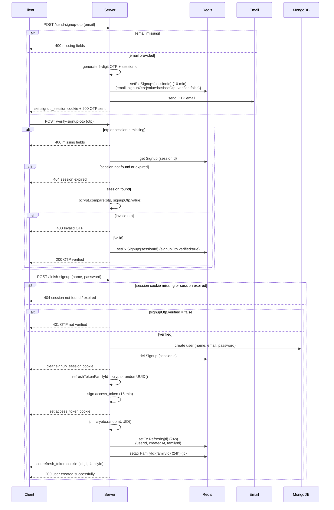
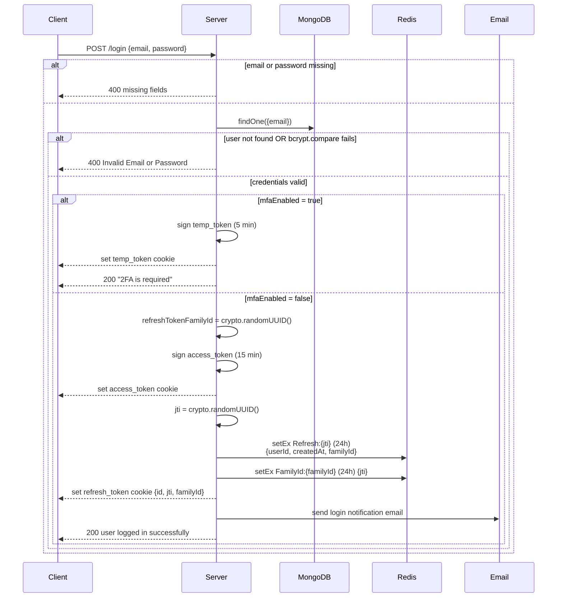
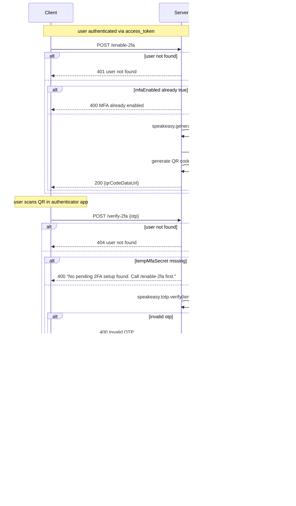
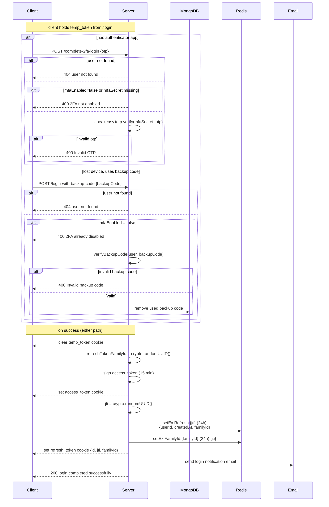
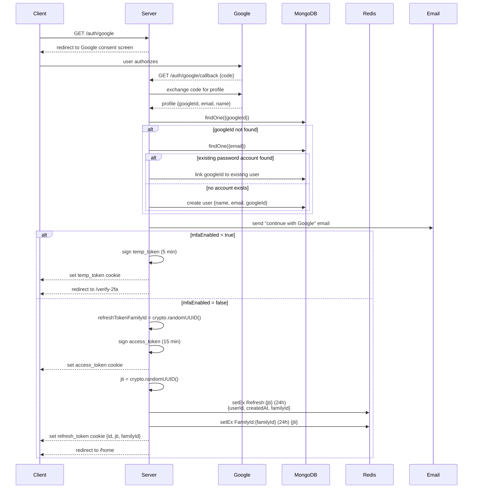
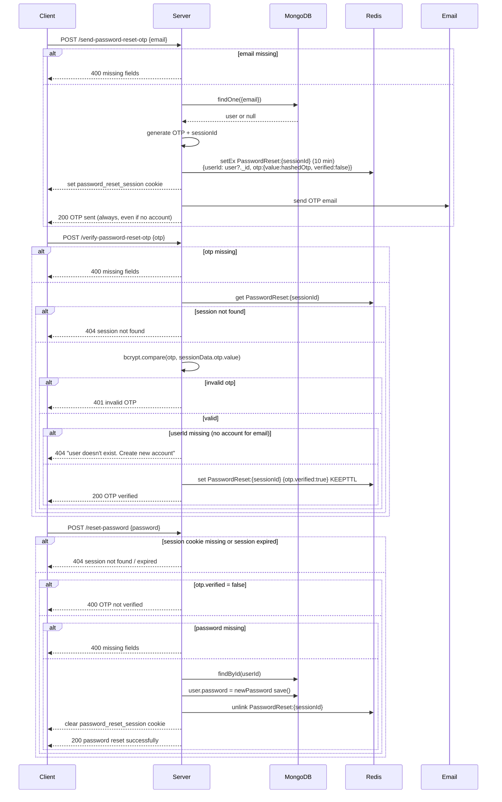
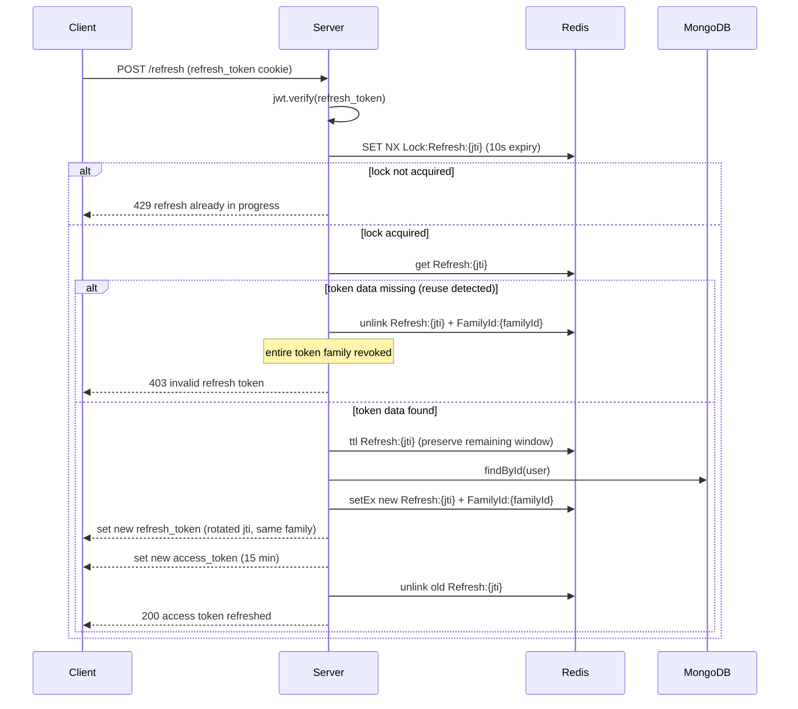

# Authentication System — Sequence Diagrams

Sequence diagrams for every scenario implemented in the MERN Authentication System, traced directly from the code in `Server/Controllers/auth/`, `Server/Middlewares/`, `Server/utils/`, and `Server/config/PassportStrategies/`.

Rendered with [Mermaid](https://mermaid.js.org/) — GitHub renders these natively inside fenced ` ```mermaid ` code blocks, no extra tooling required.

## Table of contents

1. [Signup (OTP-gated)](#1-signup-otp-gated)
2. [Login](#2-login)
3. [Enable 2FA (TOTP setup)](#3-enable-2fa-totp-setup)
4. [Complete 2FA login](#4-complete-2fa-login)
5. [Google OAuth login](#5-google-oauth-login)
6. [Password reset](#6-password-reset)
7. [Refresh token rotation with reuse detection](#7-refresh-token-rotation-with-reuse-detection)

---

## 1. Signup (OTP-gated)

Endpoints: `POST /send-signup-otp` → `POST /verify-signup-otp` → `POST /finish-signup`



---

## 2. Login

Endpoint: `POST /login`



---

## 3. Enable 2FA (TOTP setup)

Endpoints: `POST /enable-2fa` → `POST /verify-2fa`



---

## 4. Complete 2FA login

Endpoints: `POST /complete-2fa-login` (TOTP) or `POST /login-with-backup-code` (fallback)



---

## 5. Google OAuth login

Endpoints: `GET /auth/google` → `GET /auth/google/callback`



---

## 6. Password reset

Endpoints: `POST /send-password-reset-otp` → `POST /verify-password-reset-otp` → `POST /reset-password`



---

## 7. Refresh token rotation with reuse detection

Endpoint: `POST /refresh`


